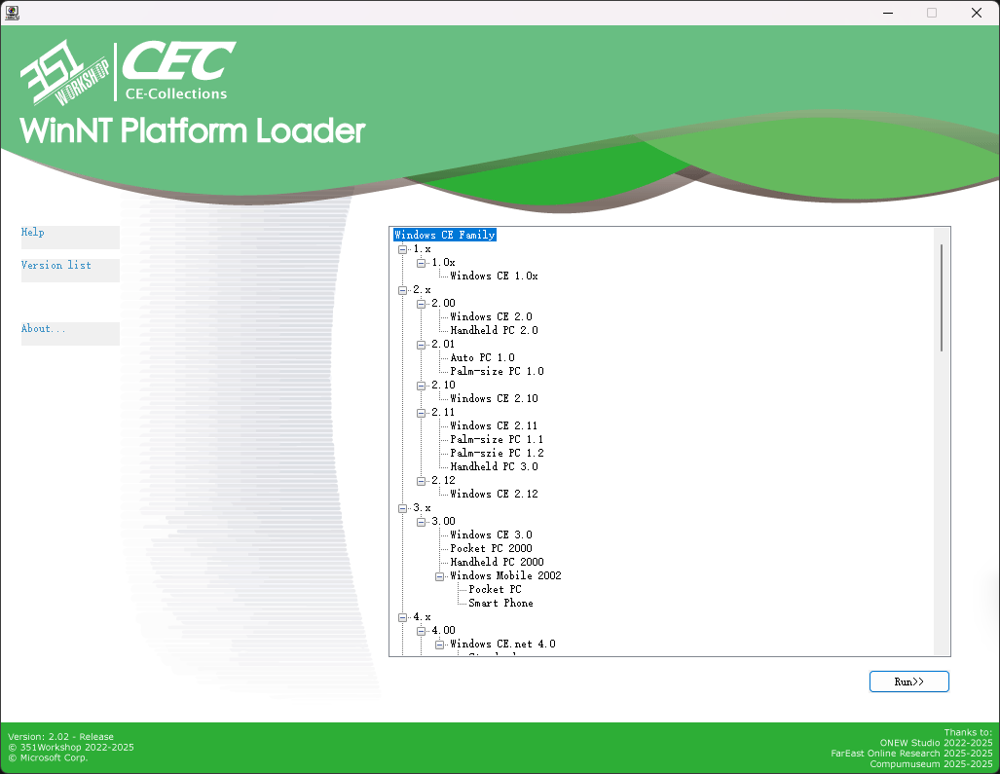
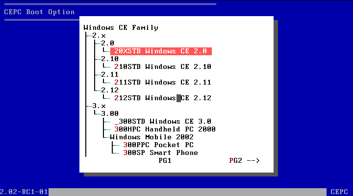
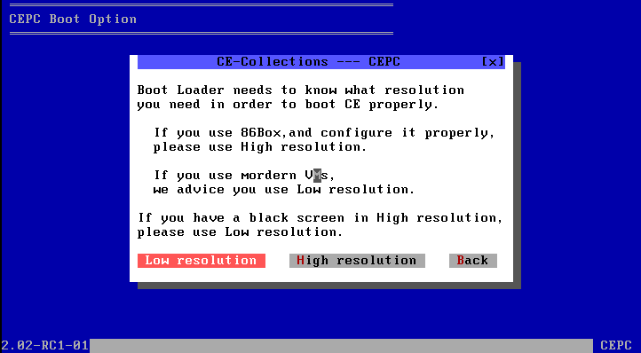
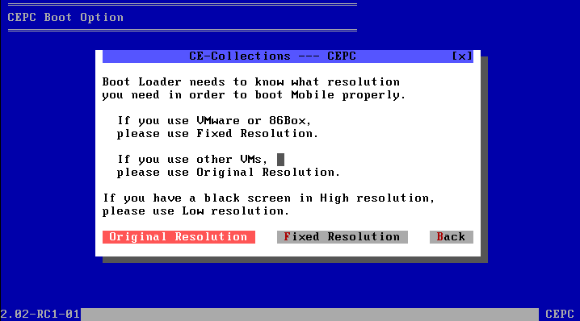

   
  <h1>CE Collections -2.02-</h1>
  
不止一个合集

  

    English 2.01 version: <a href="./README_EN.md">https://github.com/WindowsNT351/CE-Collections/blob/main/README_EN.md</a> 
  

---

# ✏️ 什么是 CE Collections
CE Collections 集合了几乎所有基于 CE 内核的官方Windows版本（例如 Windows CE Core,Windows Mobile,Windows Phone等）的镜像和模拟器。

镜像包括：
- 使用 Loadcepc 引导的 x86Bin 镜像
- 使用 DeviceEmulator 引导的 ArmBin 镜像
- 使用 XDE Emulator 引导的 ArmBin 镜像

模拟器包括：
- 适用于 Windows 7-11 的 <a href="https://github.com/WindowsNT351/Whitebox">Whitebox</a> 模拟器
- 适用于 Windows XP-11 的 Arm DeviceEmulator 模拟器
- 适用于 Windows 7 - 8.1 的 XDE Emulator 模拟器
- 适用于 Windows NT(4.0-11,部分版本不支持新的Windows版本) 的独立 Shell 模拟器

# 📥 如何使用
## WinNT平台模拟器使用方法
1. 在插入光盘之前，启动宿主操作系统（NT4.0-Win11）。
2. 插入光盘并等待弹出菜单，如果没有，运行[CD(DVD)ROM]：\WNT\Menu3.exe。
3. 选择要启动的操作系统（模拟器）。注意，当使用不同的主机操作系统时，会有一些不同的限制。
 - Windows NT 4.0 可用Shell Emulator，这是Shell Emulator的最佳宿主操作系统。
 - Windows 2000 - XP 可以Shell Emulator（x64宿主系统上不能运行Auto PC 1.0）和ARM DeviceEmulator。
 - Windows 7 - 8.1 可用Shell Emulator（Pocket PC 2000和x64宿主系统上的Auto PC 1.0除外）ARM DeviceEmulator、XDE Emulator和Whitebox Emulator。
 - Windows 10 - 11 可用Shell Emulator（Pocket PC 2000和x64宿主系统上的Auto PC 1.0除外）ARM DeviceEmulator和Whitebox Emulator。

4. 完成！

## CEPC平台使用方法

**注意！CEPC平台并不能启动全部镜像或模拟器。**
1. 插入光盘（或启动软盘）并从中启动。
2. 选择要启动的操作系统，[下一页]和[上一页]按键位于右下角和左下角。注意，启动镜像时存在一些限制。
 - 全部镜像
   - 请使用大于64MB以上的内存，否则有些过大的镜像不能装载进内存或可用运行用内存过小，推荐使用128MB。
 - Windows CE 2.0-2.10
   - 对于PCem、VMware、VBox、Qemu现代实体机或其他现代虚拟机，这些镜像无法正常启动。
   - 对于86Box，请使用WinChip CPU，并关闭动态重编译器。
   - 对于实体机，请使用486或Pentium（586）CPU。
   
3. 选择想使用的分辨率或确认启动。请注意，启动镜像有时存在一些限制。
 - VGA8BPP显示驱动：
   - 对于VMware、VBox、Qemu或其他现代虚拟机，只能使用低分辨率模式。
   - 对于86Box PCem或实体机，务必使用S3视频卡（WinCE2.0使用S3Trio64，其他版本使用S3Virge），这样能开启高分辨率，否则只能使用低分辨率。
 - Windows Mobile 的VESA显示驱动：
   - 由于Windows Mobile显示为竖向，有些显卡在遇到此分辨率时会显示错误，发生这种情况时请尝试使用另一个分辨率。
   
   
4. 完成！

# 🔧 CE-Collections 各部分是如何工作的
## WinNT Platform
1. 插入光盘，自动打开[CD(DVD)ROM]:\WNT\Menu3.exe
2. Menu3.exe加载显示[CD(DVD)ROM]:\WNT\menu.enus配置文件，加载[CD(DVD)ROM]:\CECV20.D0版本配置文件。
3. 选择要启动的模拟器/镜像
  - Shell Emulator类
    1. 使用shellmgr [模拟器种类] [路径] [主程序名称]。
    2. shellmgr将模拟器复制到系统（用户）TEMP文件夹。
    3. shellmgr检测宿主系统是否符合当前模拟器。
    4. shellmgr对于不同模拟器做准备工作。
      - WinCE 1.0： 设置需要的环境变量
      - HPC/PPC 2.x： 替换模板注册表内模拟器路径，合并注册表
      - PPC 2000： 替换模板注册表内模拟器路径，合并注册表（不同的目录结构）
      - APC 1.0： 替换模板注册表内模拟器路径，合并注册表，加载WCEFS.sys驱动，如果是Windows Vista以上系统，循环终止ApcHook.sys(如果不终止会导致系统蓝屏)。
    5. shellmgr启动对应的主程序。
    6. shellmgr等待主程序关闭。
    7. shellmgr卸载装载的驱动，删除临时文件。
  - ARM DeviceEmulator类
    1. 直接使用DeviceEmulator /video [适用于本镜像的分辨率] /memsize 256
  - CEPC WhiteboxEmulator类
    1. 直接使用Whitebox [分辨率选择，见CEPC，相比于DOSCEPC，此处区分更详细] /M:[对应的86Box配置文件] [NK.bin]
  - XDE Emulator类
    1. 使用xdemgr [XDE版本] [NK.bin]。
    2. xdemgr检测宿主系统是否符合当前模拟器。
    3. xdemgr复制XDE的VMM.sys(系统为32位)或VMM64.sys(系统为64位)到TEMP文件夹并加载。
    4. xdemgr复制XDE的配置文件到TEMP文件夹。
    5. xdemgr启动XDE模拟器。
    6. xdemgr等待XDE关闭。
    7. xdemgr卸载驱动，删除临时文件。
## CEPC Platform
1. 插入光盘/启动软盘，并从中引导至MS-DOS 7.1。
2. 加载LOGO.sys显示启动logo。加载光驱驱动（IDE）。
3. 检测D:是否为CE-Collections光盘，若不是，遍历寻找。
4. 打开[CD(DVD)ROM]:\DOS\Menu.bat，加载[CD(DVD)ROM]:\CECV20.D0版本配置文件。
5. 用户选择启动的镜像。
6. 自动检测选择的镜像为何种镜像（2.0-2.10/2.11-2.12 HPC2000/3.0-2013/WinMobile）。
  - 2.0-2.10
    1. 显示警告提示框。
    2. 使用Loadcepc /D:3 [NK.bin]
  - 2.11-2.12 HPC2000
    1. 显示分辨率选择提示框。
    2. 高分辨率使用Loadcepc /D:3 [NK.bin]
       低分辨率使用Loadcepc /D:0 [NK.bin]（此分辨率几乎不可用）
  - 3.0-2013
    1. 显示确认启动提示框。
    2. 使用Loadcepc /L:800x600x16 [NK.bin]
  - WinMobile
    1. 显示分辨率选择提示框。
    2. 修复分辨率使用Loadcepc /L:175x240x16 [NK.bin]
       原始分辨率使用Loadcepc /L:320x400x16 [NK.bin]
### Loadcepc是什么？
Loadcepc是Windows CE x86镜像的引导器（Bootloader），起到将NK.bin加载至内存，设置显示分辨率，跳转到指定地址的作用。
DOS只是CE启动的跳板，CE启动后，DOS提供的中断例程和驻留在内存的程序将不可用，x86CE不是基于DOS的。

# ❓ QA
Q: 在 86Box 或 PCem 中无法引导光盘  
A: 请使用 7Zip 等压缩软件打开 ISO 文件，解压 [boot] 文件夹中的 img 文件，然后从软盘引导。

Q: 在 CEPC 引导器中选择完系统后显示 “Error image section doesn't fit in allocated block”  
A: 内存可能设定过小，请适当调大内存。

Q: Windows EC 2013 引导后黑屏  
A: 内存可能设定过小，请适当调大内存。

Q: 为什么我在WinNT Loader里面打开某个版本后没有反应？  
A: 可能是窗口在Menu背后打开，或者宿主系统版本低于本模拟器所需的版本。

Q: 为什么整体内容是英文的？  
A: 因为英文镜像资源较全，构建也较完善，所以选择了英文版镜像；菜单等内容也相应采用英文格式。

Q: 我的 Windows CE/Mobile 实体机无法启动，能帮忙解决吗？ / 能帮我安装一下这个WinCE软件吗？  
A: 无法回答。

Q: 你能把其他 Windows 系统集成进来吗？  
A: 请看项目名称——答案自明。

# 🔨 本项目集成的 CE 镜像和模拟器

|                           |         |              |     CE-Collections Supporting     |                      |                      |
|---------------------------|---------|--------------|-----------------------------------|----------------------|----------------------|
|                           | Version | Core Version | Name                              | Shell                | Emulator             |
|                           | 1.x     | 1.00         | Windows CE 1.00                   | -----                | Shell Emulator       |
|                           |         | 1.01         | Windows CE 1.01                   | -----                | Shell Emulator       |
|                           | 2.x     | 2.00         | Windows CE 2.0(or 2.01?)          | -----                | CEPC                 |
|                           |         |              | Handheld PC 2.0                   | -----                | Shell Emulator       |
|                           |         | 2.01         | Auto PC 1.0                       | -----                | Shell Emulator       |
|                           |         |              | Palm-size PC 1.0                  | -----                | Shell Emulator       |
|                           |         | 2.10         | Windows CE 2.10                   | -----                | CEPC                 |
|                           |         | 2.11         | Windows CE 2.11                   | -----                | CEPC                 |
|                           |         |              | Palm-size PC 1.1 (Simplified Chinese) | -----                | Shell Emulator       |
|                           |         |              | Palm-size PC 1.2                  | -----                | Shell Emulator       |
|                           |         |              | Handheld PC 3.0                   | -----                | Shell Emulator       |
|                           |         | 2.12         | Windows CE 2.12                   | -----                | CEPC                 |
|                           | 3.x     | 3.00         | Windows CE 3.0                    | -----                | CEPC                 |
|                           |         |              | Pocket PC 2000                    | -----                | Shell Emulator       |
|                           |         |              | Handheld PC 2000                  | -----                | CEPC                 |
|                           |         |              | Windows Mobile 2002               | Pocket PC            | CEPC                 |
|                           |         |              |                                   | Smart Phone          | CEPC                 |
|                           | 4.x     | 4.00         | Windows CE 4.0                    | Standard Shell       | CEPC                 |
|                           |         |              |                                   | Thin Client          | CEPC                 |
|                           |         | 4.10         | Windows CE 4.1                    | Standard Shell       | CEPC                 |
|                           |         |              |                                   | Thin Client          | CEPC                 |
|                           |         | 4.20         | Windows CE 4.2                    | Standard Shell       | CEPC                 |
|                           |         |              |                                   | Thin Client          | CEPC                 |
|                           |         |              | Windows Mobile 2003               | Pocket PC            | CEPC                 |
|                           |         |              |                                   | Smart Phone          | CEPC                 |
|                           |         | 4.21         | Windows Mobile 2003 SE            | Pocket PC            | CEPC                 |
|                           |         |              |                                   | Smart Phone          | CEPC                 |
|                           | 5.x     | 5.00         | Windows CE 5.0                    | Standard Shell       | CEPC                 |
|                           |         |              |                                   | IP Phone             | CEPC                 |
|                           |         |              |                                   | Thin Client          | CEPC                 |
|                           |         |              | Networked Media Device 5.0        | -----                | CEPC                 |
|                           |         | 5.10         | Windows Mobile 5.0                | Pocket PC            | Device Emulator      |
|                           |         |              |                                   | Smart Phone          | Device Emulator      |
|    Windows  CE Famliy  |         |              | Windows Mobile 5.2                | Pocket PC            | Device Emulator      |
|                           |         |              |                                   | Smart Phone          | Device Emulator      |
|                           |         | 5.20         | Windows Mobile 6.0                | Pocket PC            | Device Emulator      |
|                           |         |              |                                   | Smart Phone          | Device Emulator      |
|                           |         |              | Windows Mobile 6.0.2              | Pocket PC            | Device Emulator      |
|                           |         |              |                                   | Smart Phone          | Device Emulator      |
|                           |         |              | Windows Mobile 6.1                | Pocket PC            | Device Emulator      |
|                           |         |              |                                   | Smart Phone          | Device Emulator      |
|                           |         |              | Windows Mobile 6.1.4              | Pocket PC            | Device Emulator      |
|                           |         |              |                                   | Smart Phone          | Device Emulator      |
|                           |         |              | Windows Mobile 6.5                | Pocket PC            | Device Emulator      |
|                           |         |              |                                   | Smart Phone          | Device Emulator      |
|                           |         |              | Windows Mobile 6.5.3              | Pocket PC            | Device Emulator      |
|                           |         |              |                                   | Smart Phone          | Device Emulator      |
|                           | 6.x     | 6.00         | Windows CE 6.0 (RTM&R2&R3)     | Standard Shell       | CEPC                 |
|                           |         |              |                                   | IP Phone             | CEPC                 |
|                           |         |              |                                   | Thin Client          | CEPC                 |
|                           |         |              |                                   | NMD UI(5.0)          | CEPC                 |
|                           | 7.x     | 7.00         | Windows Embedded  Compact 7.0  | Standard Shell       | CEPC                 |
|                           |         |              |                                   | Thin Client          | CEPC                 |
|                           |         |              |                                   | Silverlight   ThemeA | CEPC                 |
|                           |         |              |                                   | Silverlight   ThemeB | CEPC                 |
|                           |         |              |                                   | Silverlight   ThemeC | CEPC                 |
|                           |         |              |                                   | Silverlight   ThemeD | CEPC                 |
|                           |         |              | Automotive Embedded 7             | -----                | CEPC                 |
|                           |         |              | Windows Phone 7                   | -----                | XDE 1.0              |
|                           |         |              | Windows Phone 7 NoDo              | -----                | XDE 1.0              |
|                           |         | 7.10         | Windows Phone 7.5                 | -----                | XDE "1.2"            |
|                           |         |              | Windows Phone 7.5 Refresh         | -----                | XDE "1.2"            |
|                           |         |              | Windows Phone 7.8                 | -----                | XDE "1.2"            |
|                           | 8.x     | 8.00         | Windows Embedded  Compact 2013 | Mini Shell           | CEPC                 |
|                           |         |              |                                   | Silverlight   ThemeA | CEPC                 |
|                           |         |              |                                   | Silverlight   ThemeB | CEPC                 |
|                           |         |              |                                   | Silverlight   ThemeC | CEPC                 |
|                           |         |              |                                   | Silverlight   ThemeD | CEPC                 |

# ℹ 关于
## 开发团队 / 贡献者

  <table>
   <td>
      主开发者 
       - <a href="https://www.351workshop.top/">351 - 351Workshop@Bilibili</a> 
      赞助 
       - <a href="https://space.bilibili.com/432808178">IBM_Official@Bilibili</a> 
       - <a href="https://www.zhihu.com/people/peng-an-dr-quest/posts">蓬岸@知乎</a> 
    </td>
    <td>
      镜像 / 开发工具提供 
       - <a href="https://space.bilibili.com/432808178">IBM_Official@Bilibili</a> 
       - <a href="https://www.zhihu.com/people/peng-an-dr-quest/posts">蓬岸@知乎</a> 
       - <a href="https://alexisgaming95.neocities.org/">lucss21a@Discord</a> 
      美工 
       - <a href="https://space.bilibili.com/1756824708">WinPad - とある科学の手机副屏@Bilibili</a> 
    </td>
    <td>
      协助开发 
       - <a href="https://space.bilibili.com/648710692">Inter - -INTER_INIT-@Bilibili</a> 
       - <a href="https://space.bilibili.com/437201853">Zesa - Zesa_IO1i0lO@Bilibili</a> 
       - <a href="https://space.bilibili.com/410046866">不务正业的金苹果@Bilibili</a> 
       - <a href="https://space.bilibili.com/2057331843">DZY20070614@Bilibili</a> 
    </td>
  </table>

  开发团队 ONEW Studio QQ 群：981893945 —— 欢迎加入！

## 特别感谢
 - ONEW Studio 
 - <a href="http://panretro.com">厦门市远东在线技术研究院</a> 
 - <a href="https://www.compumuseum.com/">网页里的电脑博物馆</a> 

## 使用到的其他开源项目
- DOS-LOGO: http://retro.timb.us/Documents/Software/DOS-LOGO.html
- Whitebox: https://github.com/WindowsNT351/Whitebox

# ⚒️ SDK及其他相关工具下载
### Windows CE 1.x
#### Windows CE 1.0x
[Microsoft Visual C++ For Windows CE Version 1.0](https://archive.org/details/msvcceu.100) 
 

### Windows CE 2.x
#### Windows CE 2.00
Microsoft Windows CE Embedded Toolkit 
[Microsoft Handheld PC 2.0 Platform SDK](https://archive.org/details/wincesdk) 
#### Windows CE 2.01
Microsoft Palm-size PC 1.0 Platform SDK: [Programming Windows CE Disc](https://archive.org/details/mspress_programmingwindowsce_0970002166) 
Microsoft Auto PC 1.0 Platform SDK: [Windows CE Developers Conference DevCon 99 Conference CD](https://archive.org/details/windowscedevcon99conferencecd) 
#### Windows CE 2.10
[Microsoft Windows CE 2.10 Enhancement Pack for Windows CE Embedded Toolkit](https://www.betaarchive.com/database/view_release.php?uuid=0bef77bc-078b-468d-9ed0-18c51508948d) 
#### Windows CE 2.11
[Microsoft Windows CE 2.11 Platform Builder](https://archive.org/details/MicrosoftWindowsCEPlatformBuilder2.11Disc1.iso.7z) 
[Microsoft Palm-size PC 1.1 Platform SDK](https://web.archive.org/web/20051218093617/http://download.microsoft.com/download/wincepalm/pdasdk/1.1/WCE/CN/PPC_SDK(CHS).zip) 
Microsoft Palm-size PC 1.2 Platform SDK: [Windows CE Developers Conference DevCon 99 Conference CD](https://archive.org/details/windowscedevcon99conferencecd) 
Microsoft Handheld PC 3.0(HPC Pro) Platform SDK: [Windows CE Developers Conference DevCon 99 Conference CD](https://archive.org/details/windowscedevcon99conferencecd) 
#### Windows CE 2.12
[Microsoft Windows CE 2.12 Platform Builder](https://www.betaarchive.com/database/view_release.php?uuid=e73feaeb-c4dc-4915-9b16-1692c269d3b5) 
 

### Windows CE 3.x
#### Windows CE 3.00
[Microsoft Windows CE 3.0 Platform Builder(Part 1)](https://archive.org/details/ms-wince-pb30) 
[Microsoft Windows CE 3.0 Platform Builder(Part 2)](https://archive.org/details/ms-wince-pb30_5-11) 
[Microsoft Pocket PC 2000(Palm-size PC 3.0) Platform SDK(Backup)](https://pan.baidu.com/s/14ykCvhJfTmiYzloPs6ApRg) 提取码6zjx 
[Microsoft Handheld PC 2000 SDK](https://archive.org/details/hpc2ksdkusa) 
[Microsoft Smart Phone 2002 SDK](https://archive.org/download/windows-mobile-sdks-2023/smartphone_2002_sdk.exe) 
[Microsoft Pocket PC 2002 SDK](https://archive.org/download/windows-mobile-sdks-2023/ppc2002_sdk.exe) 
 

### Windows CE 4.x
#### Windows CE 4.00
[Microsoft Windows CE.net 4.0 Platform Builder Emulation Edition(Backup)](https://www.123pan.com/s/KDyhTd-zTPN3) 提取码:eGCt 
[Microsoft Windows CE.net 4.0 Platform Builder](https://www.betaarchive.com/database/view_release.php?uuid=51000b20-9a15-4403-8b56-c3759aa682b7) 
#### Windows CE 4.10
[Microsoft Windows CE.net 4.1 Platform Builder Emulation Edition](https://archive.org/details/winceemul41) 
[Microsoft Windows CE.net 4.1 Platform Builder](https://www.betaarchive.com/database/view_release.php?uuid=fc6d66f5-e047-4303-9f0e-82e7f1de6645) 
#### Windows CE 4.20
[Microsoft Windows CE.net 4.2 Platform Builder Emulation Edition](https://archive.org/details/winceemul42) 
[Microsoft Windows CE.net 4.2 Platform Builder](https://www.betaarchive.com/database/view_release.php?uuid=2b657ca7-2b53-4aac-8b1e-446b5669fda9) 
[Microsoft Windows Mobile 2003 SDK](https://archive.org/download/WMSDK/Microsoft%20Pocket%20PC%202003%20SDK.msi) 
#### Windows CE 4.21
[Microsoft Windows Mobile 2003 SE Images](https://archive.org/download/WMSDK/WM2003SEimages.msi) 
 

### Windows CE 5.x
#### Windows CE 5.00
[Microsoft Windows CE.net 5.0 Platform Builder](https://archive.org/details/en_win_ce_net_cd1) 
[Microsoft Windows CE.net 5.0 Networked Media Device Feature Pack](https://www.hpcfactor.com/downloads/2011/Windows_CE_5.0_Networked_Media_Device_Feature_Pack/version_1.0) 
#### Windows CE 5.10
[Microsoft Windows Mobile 5.0 SDK](https://archive.org/download/WMSDK/Windows%20Mobile%205.0%20Pocket%20PC%20SDK.msi) 
[Microsoft Windows Mobile 5.2 Images](https://web.archive.org/web/20130219020835/http://download.microsoft.com/download/c/b/b/cbb8bc58-07b9-46bb-86ba-d12bb0d9b1d9/efp.msi) 
#### Windows CE 5.20
[Microsoft Windows Mobile 6 Professional SDK](https://web.archive.org/web/20200108141243*/http://download.microsoft.com/download/f/2/3/f232f773-7edc-4300-be07-d3b76a5b3a91/Windows%20Mobile%206%20Professional%20SDK.msi) 
[Microsoft Windows Mobile 6 Standard SDK](https://web.archive.org/web/20200108142416*/http://download.microsoft.com/download/f/2/3/f232f773-7edc-4300-be07-d3b76a5b3a91/Windows%20Mobile%206%20Standard%20SDK.msi) 
[Microsoft Windows Mobile 6.0.2 Professional SDK](https://web.archive.org/web/20231105012934*/http://download.microsoft.com/download/f/2/3/f232f773-7edc-4300-be07-d3b76a5b3a91/Windows%20Mobile%206%20Professional%20SDK%20Refresh.msi) 
[Microsoft Windows Mobile 6.0.2 Standard SDK](https://web.archive.org/web/20220707014038*/http://download.microsoft.com/download/f/2/3/f232f773-7edc-4300-be07-d3b76a5b3a91/Windows%20Mobile%206%20Standard%20SDK%20Refresh.msi) 
[Microsoft Windows Mobile 6.1 Standard Images](https://web.archive.org/web/20130330025109/http://download.microsoft.com/download/d/c/7/dc73c8e7-f9c3-49de-821f-5588eeefcac4/Windows%20Mobile%206.1%20Standard%20Images%20(USA).msi) 
[Microsoft Windows Mobile 6.1 Professional Images](https://web.archive.org/web/20130330025531/http://download.microsoft.com/download/d/c/7/dc73c8e7-f9c3-49de-821f-5588eeefcac4/Windows%20Mobile%206.1%20Professional%20Images%20(USA).msi) 
[Microsoft Windows Mobile 6.1.4 Professional Images](https://archive.org/download/WMSDK/Windows%20Mobile%206.1.4%20Professional%20Images%20%28USA%29.msi) 
[Microsoft Windows Mobile 6.1.4 Standard Images](https://archive.org/download/WMSDK/Windows%20Mobile%206.1.4%20Standard%20Images%20%28USA%29.msi) 
[Microsoft Windows Mobile 6.5 Professional DKT](https://archive.org/download/WMSDK/Windows%20Mobile%206.5%20Professional%20Developer%20Tool%20Kit%20%28USA%29.msi) 
[Microsoft Windows Mobile 6.5 Standard DKT](https://archive.org/download/WMSDK/Windows%20Mobile%206.5%20Standard%20Developer%20Tool%20Kit%20%28USA%29.msi) 
[Microsoft Windows Mobile 6.5.3 Professional DKT](https://archive.org/download/WMSDK/Windows%20Mobile%206.5.3%20Professional%20DTK.msi) 
[Microsoft Windows Mobile 6.5.3 Standard DKT](https://archive.org/download/WMSDK/Windows%20Mobile%206.5.3%20Standard%20DTK.msi) 
 

### Windows CE 6.x
#### Windows CE 6.00
[Microsoft Windows Embedded CE 6.0 Platform Builder](https://archive.org/details/en_windows_embedded_ce_6.0_dvd) 
[Microsoft Windows Embedded CE 6.0 Platform Builder R2](https://archive.org/details/windows-embedded-ce-6.0-r2) 
[Microsoft Windows Embedded CE 6.0 Platform Builder R3](https://archive.org/details/en_windows_embedded_ce_6.0_r3_dvd__x16-28730) 
 

### Windows CE 7.x
#### Windows CE 7.00
[Microsoft Windows Embedded Compact 7.0 Platform Builder](https://archive.org/details/WindowsEmbeddedCompact7) 
[Microsoft Windows Embedded Automotive 7.0 Platform Builder](https://archive.org/details/windows-embedded-automotive-7) 
[Microsoft Windows Phone 7 SDK](https://archive.org/download/wpdt-rtm-en-1/WPDT_RTM_en1.iso) 
#### Windows CE 7.10
[Microsoft Windows Phone 7.1 SDK](https://archive.org/download/wpsdkv-71-en-1_202303/WPSDKv71_en1.iso) 
 

### Windows CE 8.x
#### Windows CE 8.00
[Microsoft Windows Embedded Compact 2013 Platform Builder](https://archive.org/details/en_windows_embedded_compact_2013_x86_x64_dvd_2247108)

## 🤝友情链接
[WinPad的CEShellCollection](https://github.com/WinPad1993/Windows_CE_Win32_Shell_Emulator_Collection_in_a_WindowsPE) 
👆点击戳一下WinPad 
[Inter的PenPointOS模拟器](https://github.com/Inter1006/PenPointOS_Vbox/tree/main) 
👆点击戳一下Inter 

    
Copyright 351Workshop 2022-2025

