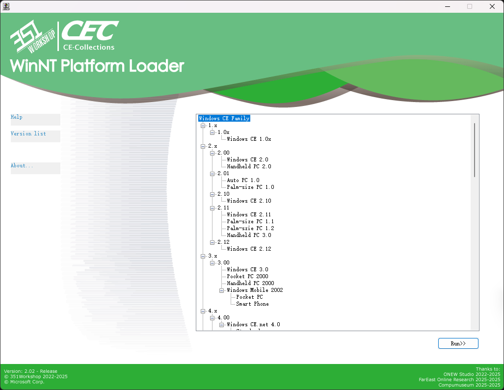

   
  <h1>CE Collections -2.02-</h1>
  
Not just a simple collection.

---

# ✏️ What is CE Collections?
CE Collections gathers almost all the official images and emulators based on the CE kernel (such as Windows CE Core Windows Mobile and Windows Phone).

The image includes:
- x86Bin images booted via Loadcepc.
- ArmBin images booted via DeviceEmulator.
- ArmBin images booted via XDE Emulator.

The emulator includes:
- <a href="https://github.com/WindowsNT351/Whitebox">Whitebox</a> Emulator compatible with Windows 7 - 11.
- Arm DeviceEmulator Emulator compatible with Windows XP - 11.
- XDE Emulator Emulator compatible with Windows 7 - 8.1.
- Standalone Shell Emulator Emulator compatible with Windows NT(4.0 - 11, some of them don't support newer Windows).

# 📥 How to use?
## WinNT Platform Emulator usage
  1. Boot the host OS(NT4.0 - Win11) before you Insert the disc.
  2. Insert the disc and wait the Menu pop out, if not, please run [CD(DVD)ROM]:\WNT\Menu3.exe.
  3. Select the OS(emulator) you want to start up. Please notice that there is some diffrent limitations when you're using diffrent host OS.
    - for Windows NT 4.0, you can use emulators based on Shell Emulator, this is the best host OS to use Shell Emulator.
    - for Windows 2000 - XP, you can use emulators based on Shell Emulator(except Auto PC 1.0 on x64 OS) and ARM Device Emulator.
    - for Windows 7 - 8.1, you can use emulator based on Shell Emulator(except Pocket PC 2000, and Auto PC 1.0 on x64 OS) ARM Device Emulator XDE Emulator and Whitebox Emulator.
    - for Windows 10 - 11, you can use emulator based on Shell Emulator(except Pocket PC 2000, and Auto PC 1.0 on x64 OS) ARM Device Emulator and Whitebox Emulator.
  4. Done! Enjoy your Windows CE.

## CEPC Platform Emulator usage
**Attention! CEPC Platform cannot boot all the images!**
  0. Make sure you have more than 64MB memory, lower than 64MB may cause the image can't be loaded into the memory. We suggest to use 128MB memory to use CEPC.
  1. Insert the disc(or boot floppy) and boot from it.
  2. Select the OS you want to boot, the [Next Page] and the [Previous Page] are in the bottom right and bottom left corner.Please notice that there is some limitations when you're booting 2.0-2.10 images.
    - for PCem VMware VBox Qemu modern real machine or other modern VMs, these image won't boot properly.
    - for 86Box, please use WinChip CPU without Dynamic Recompiler.
    - for old real machine, please use 486 or Pentium(586) CPU.
    
  3. Select the resolution you want. Please notice that there is some limitations when you're booting 2.0-3.0 images which using VGA8BPP display driver.
    - for VMware VBox Qemu or other modern VMs, you can only use the Low Resolution mode.
    - for 86Box PCem or real machine, please use S3 video card(particular S3Trio64 for WinCE2.0 or S3Virge for higher version) as much as possible to use the High Resolution, if not, you can only use the Low Resolution.
      
      
  4. Done! Enjoy your Windows CE.

# 🔧 How does CE-Collections works?
## WinNT Platform
1. Insert the disc, Autorun will start [CD(DVD)ROM]:\WNT\Menu3.exe.
2. Menu3.exe load and display [CD(DVD)ROM]:\WNT\menu.enus configuration file, and load [CD(DVD)ROM]:\CECV20.D0 version config file.
3. Choose the emulator / image you want to boot(start).
  - Shell Emulator Family
    1. Run shellmgr [Type of emulator] [Path to emulator] [Main executable file path].
    2. Shellmgr copy the whole emulator files into TEMP(User or System) folder。
    3. Shellmgr check does the host OS is the required OS.
    4. Shellmgr doing preparation works.
      - for WinCE 1.0: Set the required environment variable.
      - for HPC/PPC 2.x: Replace the path to emulator in the REG file, Merge the REG file.
      - for PPC 2000: Replace the path to emulator in the REG file, Merge the REG file.(diffrent file structure)
      - for APC 1.0：Replace the path to emulator in the REG file, Merge the REG file, load WCEFS.sys driver. If the host is vista or higher, kill ApcHook.sys driver(if doen't do that will cause BSOD)。
    5. Shellmgr start the main executable file.
    6. Shellmgr wait for the main progrom closed.
    7. Shellmgr unload the driver and delete the TEMP files.
  - ARM DeviceEmulator Fmaily
    1. Run DeviceEmulator /video [resolution] /memsize 256
  - CEPC WhiteboxEmulator Family
    1. Run Whitebox [resolution, see CEPC. But much more detailed for each image here] /M:[86Box config file] [NK.bin]
  - XDE Emulator Family
    1. Run xdemgr [XDE Version] [NK.bin]。
    2. Xdemgr check does the host OS is the required OS。
    3. Xdemgr copy VMM.sys(if host OS is x86) or VMM64.sys(if host OS is AMD64) of XDE Emulator to TEMP folder and load it.
    4. Xdemgr copy the config file of XDE Emulator into TEMP folder.
    5. Xdemgr start XDE Emulator.
    6. Xdemgr wait for the Emulator closed。
    7. Xdemgr unload the driver and delete the TEMP files.
## CEPC Platform
1. Insert the disc / boot floppy disk, boot MS-DOS 7.1 from it。
2. Load LOGO.sys display startup logo. Load CD(DVD)ROM driver(IDE)。
3. Detect is D: drive a CE-Collections disc, if not, find the disc ergodic。
4. Start [CD(DVD)ROM]:\DOS\Menu.bat, Load [CD(DVD)ROM]:\CECV20.D0 version config file.
5. Choose the image to load.
6. Auto detect which type is the image(2.0-2.10/2.11-2.12 HPC2000/3.0-2013/WinMobile)。
  - 2.0-2.10
    1. Display the Warning Dialog.
    2. Run Loadcepc /D:3 [NK.bin]
  - 2.11-2.12 HPC2000
    1. Display the Resolution Choosing Dialog.
    2. High Resolution use Loadcepc /D:3 [NK.bin]
       Low Resolution use Loadcepc /D:0 [NK.bin] (this resolution almost unusable)
  - 3.0-2013
    1. Display the Confirm Dialog.
    2. Run Loadcepc /L:800x600x16 [NK.bin]
  - WinMobile
    1. Display the Resolution Choosing Dialog.
    2. Fixed Resolution use Loadcepc /L:175x240x16 [NK.bin]
       Original Resolution use Loadcepc /L:320x400x16 [NK.bin]
### What is Loadcepc?
Loadcepc is Bootloader for Windows CE x86 images, it will load the NK.bin into memory, set the resolution, and jump to the boot address.
DOS is just a springboard for CE, after CE booted, the interrupt of DOS won't work after that, x86CE does't based on DOS.

# ❓ QA
Q: I cannot boot the disc in 86Box or PCem.  
A: Please use 7Zip or another compression tool to open the ISO file, extract the img file from the [boot] folder, and then boot from a floppy disk.

Q: In the CEPC bootloader, after selecting a system, it shows “Error image section doesn't fit in allocated block”.  
A: The memory might be set too low; please increase the memory allocation.

Q: After booting Windows EC 2013, the screen is black.  
A: The memory might be set too low; please increase the memory allocation.

Q: Why there is no any activities after I choose a version in WinNT Menu?
A: The emulator may display behind the Menu, or the host OS is not the required OS for the emulator.

Q: My physical Windows CE/Mobile device doesn’t boot, can you help solve this? / Can you install this WinCE software for me?
A: Well, I can't answer that.

Q: Can you integrate other Windows OS?  
A: Just look at the project name – the answer is self-evident.

# 🔨 CE Images and Emulators Integrated in this Project

|                           |         |              |     CE-Collections Supporting     |                      |                      |
|---------------------------|---------|--------------|-----------------------------------|----------------------|----------------------|
|                           | Version | Core Version | Name                              | Shell                | Emulator             |
|                           | 1.x     | 1.00         | Windows CE 1.00                   | -----                | Shell Emulator       |
|                           |         | 1.01         | Windows CE 1.01                   | -----                | Shell Emulator       |
|                           | 2.x     | 2.00         | Windows CE 2.0(or 2.01?)          | -----                | CEPC                 |
|                           |         |              | Handheld PC 2.0                   | -----                | Shell Emulator       |
|                           |         | 2.01         | Auto PC 1.0                       | -----                | Shell Emulator       |
|                           |         |              | Palm-size PC 1.0                  | -----                | Shell Emulator       |
|                           |         | 2.10         | Windows CE 2.10                   | -----                | CEPC                 |
|                           |         | 2.11         | Windows CE 2.11                   | -----                | CEPC                 |
|                           |         |              | Palm-size PC 1.1 (Simplified Chinese) | -----                | Shell Emulator       |
|                           |         |              | Palm-size PC 1.2                  | -----                | Shell Emulator       |
|                           |         |              | Handheld PC 3.0                   | -----                | Shell Emulator       |
|                           |         | 2.12         | Windows CE 2.12                   | -----                | CEPC                 |
|                           | 3.x     | 3.00         | Windows CE 3.0                    | -----                | CEPC                 |
|                           |         |              | Pocket PC 2000                    | -----                | Shell Emulator       |
|                           |         |              | Handheld PC 2000                  | -----                | CEPC                 |
|                           |         |              | Windows Mobile 2002               | Pocket PC            | CEPC                 |
|                           |         |              |                                   | Smart Phone          | CEPC                 |
|                           | 4.x     | 4.00         | Windows CE 4.0                    | Standard Shell       | CEPC                 |
|                           |         |              |                                   | Thin Client          | CEPC                 |
|                           |         | 4.10         | Windows CE 4.1                    | Standard Shell       | CEPC                 |
|                           |         |              |                                   | Thin Client          | CEPC                 |
|                           |         | 4.20         | Windows CE 4.2                    | Standard Shell       | CEPC                 |
|                           |         |              |                                   | Thin Client          | CEPC                 |
|                           |         |              | Windows Mobile 2003               | Pocket PC            | CEPC                 |
|                           |         |              |                                   | Smart Phone          | CEPC                 |
|                           |         | 4.21         | Windows Mobile 2003 SE            | Pocket PC            | CEPC                 |
|                           |         |              |                                   | Smart Phone          | CEPC                 |
|                           | 5.x     | 5.00         | Windows CE 5.0                    | Standard Shell       | CEPC                 |
|                           |         |              |                                   | IP Phone             | CEPC                 |
|                           |         |              |                                   | Thin Client          | CEPC                 |
|                           |         |              | Networked Media Device 5.0        | -----                | CEPC                 |
|                           |         | 5.10         | Windows Mobile 5.0                | Pocket PC            | Device Emulator      |
|                           |         |              |                                   | Smart Phone          | Device Emulator      |
|    Windows  CE Famliy  |         |              | Windows Mobile 5.2                | Pocket PC            | Device Emulator      |
|                           |         |              |                                   | Smart Phone          | Device Emulator      |
|                           |         | 5.20         | Windows Mobile 6.0                | Pocket PC            | Device Emulator      |
|                           |         |              |                                   | Smart Phone          | Device Emulator      |
|                           |         |              | Windows Mobile 6.0.2              | Pocket PC            | Device Emulator      |
|                           |         |              |                                   | Smart Phone          | Device Emulator      |
|                           |         |              | Windows Mobile 6.1                | Pocket PC            | Device Emulator      |
|                           |         |              |                                   | Smart Phone          | Device Emulator      |
|                           |         |              | Windows Mobile 6.1.4              | Pocket PC            | Device Emulator      |
|                           |         |              |                                   | Smart Phone          | Device Emulator      |
|                           |         |              | Windows Mobile 6.5                | Pocket PC            | Device Emulator      |
|                           |         |              |                                   | Smart Phone          | Device Emulator      |
|                           |         |              | Windows Mobile 6.5.3              | Pocket PC            | Device Emulator      |
|                           |         |              |                                   | Smart Phone          | Device Emulator      |
|                           | 6.x     | 6.00         | Windows CE 6.0 (RTM&R2&R3)     | Standard Shell       | CEPC                 |
|                           |         |              |                                   | IP Phone             | CEPC                 |
|                           |         |              |                                   | Thin Client          | CEPC                 |
|                           |         |              |                                   | NMD UI(5.0)          | CEPC                 |
|                           | 7.x     | 7.00         | Windows Embedded  Compact 7.0  | Standard Shell       | CEPC                 |
|                           |         |              |                                   | Thin Client          | CEPC                 |
|                           |         |              |                                   | Silverlight   ThemeA | CEPC                 |
|                           |         |              |                                   | Silverlight   ThemeB | CEPC                 |
|                           |         |              |                                   | Silverlight   ThemeC | CEPC                 |
|                           |         |              |                                   | Silverlight   ThemeD | CEPC                 |
|                           |         |              | Automotive Embedded 7             | -----                | CEPC                 |
|                           |         |              | Windows Phone 7                   | -----                | XDE 1.0              |
|                           |         |              | Windows Phone 7 NoDo              | -----                | XDE 1.0              |
|                           |         | 7.10         | Windows Phone 7.5                 | -----                | XDE "1.2"            |
|                           |         |              | Windows Phone 7.5 Refresh         | -----                | XDE "1.2"            |
|                           |         |              | Windows Phone 7.8                 | -----                | XDE "1.2"            |
|                           | 8.x     | 8.00         | Windows Embedded  Compact 2013 | Mini Shell           | CEPC                 |
|                           |         |              |                                   | Silverlight   ThemeA | CEPC                 |
|                           |         |              |                                   | Silverlight   ThemeB | CEPC                 |
|                           |         |              |                                   | Silverlight   ThemeC | CEPC                 |
|                           |         |              |                                   | Silverlight   ThemeD | CEPC                 |

# ℹ About
## Develoment Team / Contributor

  <table>
   <td>
      Developer 
       - <a href="https://www.351workshop.top/">351 - 351Workshop@Bilibili</a> 
      Sponsor 
       - <a href="https://space.bilibili.com/432808178">IBM_Official@Bilibili</a> 
       - <a href="https://www.zhihu.com/people/peng-an-dr-quest/posts">蓬岸@知乎</a> 
    </td>
    <td>
      Image / Develoment Tools Providing 
       - <a href="https://space.bilibili.com/432808178">IBM_Official@Bilibili</a> 
       - <a href="https://www.zhihu.com/people/peng-an-dr-quest/posts">蓬岸@知乎</a> 
       - <a href="https://alexisgaming95.neocities.org/">lucss21a@Discord</a> 
      Artworks 
       - <a href="https://space.bilibili.com/1756824708">WinPad - とある科学の手机副屏@Bilibili</a> 
    </td>
    <td>
      Development Helper 
       - <a href="https://space.bilibili.com/648710692">Inter - -INTER_INIT-@Bilibili</a> 
       - <a href="https://space.bilibili.com/437201853">Zesa - Zesa_IO1i0lO@Bilibili</a> 
       - <a href="https://space.bilibili.com/410046866">不务正业的金苹果@Bilibili</a> 
       - <a href="https://space.bilibili.com/2057331843">DZY20070614@Bilibili</a> 
    </td>
  </table>

## Thanks to
 - ONEW Studio 
 - <a href="http://panretro.com">Fareast Online Research</a> 
 - <a href="https://www.compumuseum.com/">Compumuseum</a> 

## Other opensource project used in the project 
- DOS-LOGO: http://retro.timb.us/Documents/Software/DOS-LOGO.html
- Whitebox: https://github.com/WindowsNT351/Whitebox

# ⚒️ SDK and other toolkits download
### Windows CE 1.x
#### Windows CE 1.0x
[Microsoft Visual C++ For Windows CE Version 1.0](https://archive.org/details/msvcceu.100) 
 

### Windows CE 2.x
#### Windows CE 2.00
Microsoft Windows CE Embedded Toolkit 
[Microsoft Handheld PC 2.0 Platform SDK](https://archive.org/details/wincesdk) 
#### Windows CE 2.01
Microsoft Palm-size PC 1.0 Platform SDK: [Programming Windows CE Disc](https://archive.org/details/mspress_programmingwindowsce_0970002166) 
Microsoft Auto PC 1.0 Platform SDK: [Windows CE Developers Conference DevCon 99 Conference CD](https://archive.org/details/windowscedevcon99conferencecd) 
#### Windows CE 2.10
[Microsoft Windows CE 2.10 Enhancement Pack for Windows CE Embedded Toolkit](https://www.betaarchive.com/database/view_release.php?uuid=0bef77bc-078b-468d-9ed0-18c51508948d) 
#### Windows CE 2.11
[Microsoft Windows CE 2.11 Platform Builder](https://archive.org/details/MicrosoftWindowsCEPlatformBuilder2.11Disc1.iso.7z) 
[Microsoft Palm-size PC 1.1 Platform SDK](https://web.archive.org/web/20051218093617/http://download.microsoft.com/download/wincepalm/pdasdk/1.1/WCE/CN/PPC_SDK(CHS).zip) 
Microsoft Palm-size PC 1.2 Platform SDK: [Windows CE Developers Conference DevCon 99 Conference CD](https://archive.org/details/windowscedevcon99conferencecd) 
Microsoft Handheld PC 3.0(HPC Pro) Platform SDK: [Windows CE Developers Conference DevCon 99 Conference CD](https://archive.org/details/windowscedevcon99conferencecd) 
#### Windows CE 2.12
[Microsoft Windows CE 2.12 Platform Builder](https://www.betaarchive.com/database/view_release.php?uuid=e73feaeb-c4dc-4915-9b16-1692c269d3b5) 
 

### Windows CE 3.x
#### Windows CE 3.00
[Microsoft Windows CE 3.0 Platform Builder(Part 1)](https://archive.org/details/ms-wince-pb30) 
[Microsoft Windows CE 3.0 Platform Builder(Part 2)](https://archive.org/details/ms-wince-pb30_5-11) 
[Microsoft Pocket PC 2000(Palm-size PC 3.0) Platform SDK(Backup)](https://pan.baidu.com/s/14ykCvhJfTmiYzloPs6ApRg) Key 6zjx 
[Microsoft Handheld PC 2000 SDK](https://archive.org/details/hpc2ksdkusa) 
[Microsoft Smart Phone 2002 SDK](https://archive.org/download/windows-mobile-sdks-2023/smartphone_2002_sdk.exe) 
[Microsoft Pocket PC 2002 SDK](https://archive.org/download/windows-mobile-sdks-2023/ppc2002_sdk.exe) 
 

### Windows CE 4.x
#### Windows CE 4.00
[Microsoft Windows CE.net 4.0 Platform Builder Emulation Edition(Backup)](https://www.123pan.com/s/KDyhTd-zTPN3) Key eGCt 
[Microsoft Windows CE.net 4.0 Platform Builder](https://www.betaarchive.com/database/view_release.php?uuid=51000b20-9a15-4403-8b56-c3759aa682b7) 
#### Windows CE 4.10
[Microsoft Windows CE.net 4.1 Platform Builder Emulation Edition](https://archive.org/details/winceemul41) 
[Microsoft Windows CE.net 4.1 Platform Builder](https://www.betaarchive.com/database/view_release.php?uuid=fc6d66f5-e047-4303-9f0e-82e7f1de6645) 
#### Windows CE 4.20
[Microsoft Windows CE.net 4.2 Platform Builder Emulation Edition](https://archive.org/details/winceemul42) 
[Microsoft Windows CE.net 4.2 Platform Builder](https://www.betaarchive.com/database/view_release.php?uuid=2b657ca7-2b53-4aac-8b1e-446b5669fda9) 
[Microsoft Windows Mobile 2003 SDK](https://archive.org/download/WMSDK/Microsoft%20Pocket%20PC%202003%20SDK.msi) 
#### Windows CE 4.21
[Microsoft Windows Mobile 2003 SE Images](https://archive.org/download/WMSDK/WM2003SEimages.msi) 
 

### Windows CE 5.x
#### Windows CE 5.00
[Microsoft Windows CE.net 5.0 Platform Builder](https://archive.org/details/en_win_ce_net_cd1) 
[Microsoft Windows CE.net 5.0 Networked Media Device Feature Pack](https://www.hpcfactor.com/downloads/2011/Windows_CE_5.0_Networked_Media_Device_Feature_Pack/version_1.0) 
#### Windows CE 5.10
[Microsoft Windows Mobile 5.0 SDK](https://archive.org/download/WMSDK/Windows%20Mobile%205.0%20Pocket%20PC%20SDK.msi) 
[Microsoft Windows Mobile 5.2 Images](https://web.archive.org/web/20130219020835/http://download.microsoft.com/download/c/b/b/cbb8bc58-07b9-46bb-86ba-d12bb0d9b1d9/efp.msi) 
#### Windows CE 5.20
[Microsoft Windows Mobile 6 Professional SDK](https://web.archive.org/web/20200108141243*/http://download.microsoft.com/download/f/2/3/f232f773-7edc-4300-be07-d3b76a5b3a91/Windows%20Mobile%206%20Professional%20SDK.msi) 
[Microsoft Windows Mobile 6 Standard SDK](https://web.archive.org/web/20200108142416*/http://download.microsoft.com/download/f/2/3/f232f773-7edc-4300-be07-d3b76a5b3a91/Windows%20Mobile%206%20Standard%20SDK.msi) 
[Microsoft Windows Mobile 6.0.2 Professional SDK](https://web.archive.org/web/20231105012934*/http://download.microsoft.com/download/f/2/3/f232f773-7edc-4300-be07-d3b76a5b3a91/Windows%20Mobile%206%20Professional%20SDK%20Refresh.msi) 
[Microsoft Windows Mobile 6.0.2 Standard SDK](https://web.archive.org/web/20220707014038*/http://download.microsoft.com/download/f/2/3/f232f773-7edc-4300-be07-d3b76a5b3a91/Windows%20Mobile%206%20Standard%20SDK%20Refresh.msi) 
[Microsoft Windows Mobile 6.1 Standard Images](https://web.archive.org/web/20130330025109/http://download.microsoft.com/download/d/c/7/dc73c8e7-f9c3-49de-821f-5588eeefcac4/Windows%20Mobile%206.1%20Standard%20Images%20(USA).msi) 
[Microsoft Windows Mobile 6.1 Professional Images](https://web.archive.org/web/20130330025531/http://download.microsoft.com/download/d/c/7/dc73c8e7-f9c3-49de-821f-5588eeefcac4/Windows%20Mobile%206.1%20Professional%20Images%20(USA).msi) 
[Microsoft Windows Mobile 6.1.4 Professional Images](https://archive.org/download/WMSDK/Windows%20Mobile%206.1.4%20Professional%20Images%20%28USA%29.msi) 
[Microsoft Windows Mobile 6.1.4 Standard Images](https://archive.org/download/WMSDK/Windows%20Mobile%206.1.4%20Standard%20Images%20%28USA%29.msi) 
[Microsoft Windows Mobile 6.5 Professional DKT](https://archive.org/download/WMSDK/Windows%20Mobile%206.5%20Professional%20Developer%20Tool%20Kit%20%28USA%29.msi) 
[Microsoft Windows Mobile 6.5 Standard DKT](https://archive.org/download/WMSDK/Windows%20Mobile%206.5%20Standard%20Developer%20Tool%20Kit%20%28USA%29.msi) 
[Microsoft Windows Mobile 6.5.3 Professional DKT](https://archive.org/download/WMSDK/Windows%20Mobile%206.5.3%20Professional%20DTK.msi) 
[Microsoft Windows Mobile 6.5.3 Standard DKT](https://archive.org/download/WMSDK/Windows%20Mobile%206.5.3%20Standard%20DTK.msi) 
 

### Windows CE 6.x
#### Windows CE 6.00
[Microsoft Windows Embedded CE 6.0 Platform Builder](https://archive.org/details/en_windows_embedded_ce_6.0_dvd) 
[Microsoft Windows Embedded CE 6.0 Platform Builder R2](https://archive.org/details/windows-embedded-ce-6.0-r2) 
[Microsoft Windows Embedded CE 6.0 Platform Builder R3](https://archive.org/details/en_windows_embedded_ce_6.0_r3_dvd__x16-28730) 
 

### Windows CE 7.x
#### Windows CE 7.00
[Microsoft Windows Embedded Compact 7.0 Platform Builder](https://archive.org/details/WindowsEmbeddedCompact7) 
[Microsoft Windows Embedded Automotive 7.0 Platform Builder](https://archive.org/details/windows-embedded-automotive-7) 
[Microsoft Windows Phone 7 SDK](https://archive.org/download/wpdt-rtm-en-1/WPDT_RTM_en1.iso) 
#### Windows CE 7.10
[Microsoft Windows Phone 7.1 SDK](https://archive.org/download/wpsdkv-71-en-1_202303/WPSDKv71_en1.iso) 
 

### Windows CE 8.x
#### Windows CE 8.00
[Microsoft Windows Embedded Compact 2013 Platform Builder](https://archive.org/details/en_windows_embedded_compact_2013_x86_x64_dvd_2247108)

    
Copyright 351Workshop 2022-2025

